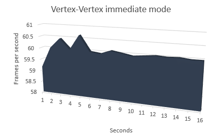
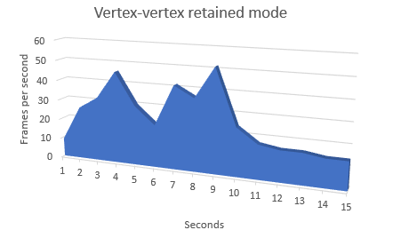
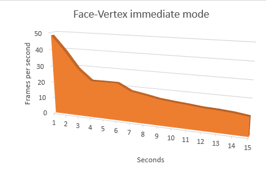
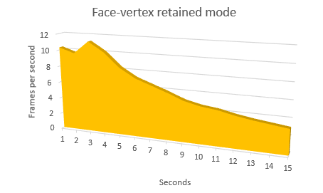

# Taller de mallas poligonales

## Propósito

Estudiar la relación entre las [aplicaciones de mallas poligonales](https://github.com/VisualComputing/representation), su modo de [representación](https://en.wikipedia.org/wiki/Polygon_mesh) (i.e., estructuras de datos empleadas para representar la malla en RAM) y su modo de [renderizado](https://processing.org/tutorials/pshape/) (i.e., modo de transferencia de la geometría a la GPU).

## Tareas

Hacer un benchmark (midiendo los *fps* promedio) de varias representaciones de mallas poligonales para los _boids_ del ejemplo del [FlockOfBoids](https://github.com/VisualComputing/framesjs/tree/processing/examples/Advanced/FlockOfBoids) (requiere la librería [frames](https://github.com/VisualComputing/framesjs/releases), versión ≥ 0.1.0), tanto en modo inmediato como retenido de rendering.

1. Represente la malla del [boid](https://github.com/VisualComputing/framesjs/blob/processing/examples/Advanced/FlockOfBoids/Boid.pde) al menos de ~tres~ dos formas distintas.
2. Renderice el _flock_ en modo inmediato y retenido, implementando la función ```render()``` del [boid](https://github.com/VisualComputing/framesjs/blob/processing/examples/Advanced/FlockOfBoids/Boid.pde).
3. Haga un benchmark que muestre una comparativa de los resultados obtenidos.

### Opcionales

1. Realice la comparativa para diferentes configuraciones de hardware.
2. Realice la comparativa de *fps* sobre una trayectoria de animación para el ojo empleando un [interpolator](https://github.com/VisualComputing/framesjs/tree/processing/examples/Basics/B8_Interpolation2) (en vez de tomar su promedio).
3. Anime la malla, como se hace en el ejemplo de [InteractiveFish](https://github.com/VisualComputing/framesjs/tree/processing/examples/ik/InteractiveFish).
4. Haga [view-frustum-culling](https://github.com/VisualComputing/framesjs/tree/processing/examples/Demos/ViewFrustumCulling) de los _boids_ cuando el ojo se encuentre en tercera persona.

### Profundizaciones

1. Introducir el rol depredador.
2. Cómo se afecta el comportamiento al tener en cuenta el [campo visual](https://es.wikipedia.org/wiki/Campo_visual) (individual)?
3. Implementar el algoritmo del ```flock()``` en [OpenCL](https://en.wikipedia.org/wiki/OpenCL). Ver [acá](https://www.youtube.com/watch?v=4NU37rPOAsk) un ejemplo de *Processing* en el que se que emplea [JOCL](http://www.jocl.org/).

### References

1. [Reynolds, C. W. Flocks, Herds and Schools: A Distributed Behavioral Model. 87](http://www.cs.toronto.edu/~dt/siggraph97-course/cwr87/).
2. Check also this [nice presentation](https://pdfs.semanticscholar.org/73b1/5c60672971c44ef6304a39af19dc963cd0af.pdf) about the paper:
3. There are many online sources, google for more...

## Integrantes

Máximo 3.

Complete la tabla:

| Integrante | github nick |
|------------|-------------|
| Miguel Angel Ballen | mballeng91|
|Tania Hurtado Pinto| TaniaHurtado|
|Ivan Darío Rojas| idrojasf|

## Entrega

* Modo de entrega: Haga [fork](https://help.github.com/articles/fork-a-repo/) de la plantilla e informe la url del repo en la hoja *urls* de la plantilla compartida (una sola vez por grupo). Plazo: 15/4/18 a las 24h.
* Exposición oral en el taller de la siguiente semana (6 minutos: 4 para presentar y 2 para preguntas). Estructura sugerida:
  1. Representaciones estudiadas.
  2. Demo.
  3. Resultados (benchmark).
  4. Conclusiones.


## Resultados obtenidos

### Introducción
    
   En el proceso de renderizado de un elemento gráfico se cuenta con dos opciones 
    dadas por Java y Processing librería de contenido gráfico para tal fin.
    Estas dos opciones son el modo retenido y el modo inmediato.
    
   El modo retenido de rendering permite almacenar el contenido de un
    elemento perteneciente a alguna escena en Processing en la memoria
    del dispositivo antes de ser mostrado en la pantalla. Esto puede ser
    útil en determinados casos en los que el dispositivo cuenta con
    cierta limitación de procesamiento y se apoya en el uso de la memoria RAM.
    
   Por otra parte el modo inmediato permite renderizar un elemento 
    gráfico sin referenciar o almacenar su contenido en la memoria RAM
    del dispositivo que ejecuta el procedimiento de renderizado.

###  Mallas poligonales - objetivos
    
   En el procedimiento realizado a nivel de hardware para el presente taller,
    se busca evaluar el comportamiento a nivel de hardware cuando se 
    renderiza una malla poligonal en modo inmediato y en modo retenido
    con diferentes configuraciones.
    
   >Una malla poligonal es una abstracción de la información relacionada
    con un sólido que pueda representarse por una cantidad determinada
    de caras o planos con forma de algún polígono regular.
    
### Procedimiento
    
   En el presente caso de estudio se renderizó un conjunto de 
    mallas poligonales. En particular un numero variable de tetrahedros que 
    conforman una manada que posee un comportamiento de un agente con vida artificial
    dado de forma inicial.
    <p align="center">
    
    </p>
   Se procedió a la declaración de dos estructuras de datos para las representaciones
    de las mallas poligonales. En particular se seleccionaron las 
    representaciones Face-vertex   y Vertex-Vertex.
    
   En la representación Face-Vertex se tienen dos listas. Una que contiene
    la información de cada una de las caras que conforman la malla poligonal
    y otra con los vertices que conforman las caras mencionadas anteriormente.
    A partir de allí es suficiente con recorrer los elementos contenidos
    dentro de la lista de caras para renderizarlas una a una y así 
    formar en el sketch el sólido esperado.
    
   En cuanto a la representación Vertex-Vertex, se cuenta con una única
    lista que debe recorrerse en un orden determinado para extraer la 
    información perteneciente a los vertices que conforman la malla e ir
    renderizando las caras mediante el uso de las funciones beginShape(),
    vertex(a1,a2,a3) y endShape().
    <p align="center">
   
     </p>
   Estos métodos forman parte del conjunto de instrucciones de Processing,
    que pueden emplearse para formar cualquier tipo de figura geométrica
    en 2 y 3 dimensiones.
    
   Para el modo retenido a nivel de implementación, es necesario instanciar
    un objeto de la clase PShape también de processing para que en la memoria
    se almacene la información de la forma a la cual se quiere representar
    y renderizar en el sketch.   
    <p align="center">
    
    </p>
  

### Resultados
   Para evaluar el comportamiento de la cpu y de la ejecución del
    programa, se seleccionaron 4 escenarios de prueba para la 
    representación de la malla poligonal en particular del tetra-
    hedro:
   
   #### Datos de la máquina 
   La ejecución se llevo a cabo en un CPU Intel Core i5 a 2.5GHz
   con memoria RAM de 6GB y 50 boids en el flock.
      
   * Representación vertex-vertex modo inmediato
         <p align="center">
     
     </p>
     
     Se evidencia un comportamiento uniforme del valor FPS
     a medida que avanza el tiempo de ejecución. Alcanza un
     maximo al haberse trascurrido 5 segundos pero luego perma-
     nece poco disperso.
   
   * Representación vertex-vertex modo retenido
         <p align="center">
     
     </p>
     El comportamiento de la variable FPS es algo inestable
     en comparación al modo inmediato. Es posible alcanzar picos
     en tiempos más adelantados en comparación al modo inmediato.
     
   * Representación face-vertex modo inmediato
         <p align="center">
     
     </p>
     Se tiene un comportamiento decreciente para este tipo de 
     representación, lo cual indica que no suele emplearse mucho
     si se busca un rendimiento óptimo en el proceso de renderizado.
   * Representación face-vertex modo retenido
          <p align="center">
      
     </p>
     
     De los escenarios estudiados es por mucho el que menos ventajas
     ofrece. Además de guardar información sobre la malla en varias
     estructuras de datos no alcanza un índice de FPS alto en comparación
     a los demás escenarios.

   #### Datos de la máquina 
   La segunda ejecución se llevo a cabo en un CPU Intel Core i5 a 2.7GHz
   con memoria RAM de 8GB y 100 boids en el flock.
      
   * Representación vertex-vertex modo inmediato
         <p align="center">
     
     </p>
     
     Luego del segundo 5 podemos evidenciar un comportamiento uniforme del valor FPS
     a medida que avanza el tiempo de ejecución, luego de eso, se mantiene constante.
   
   * Representación vertex-vertex modo retenido
         <p align="center">
     
     </p>
     A comparación del modo inmediato, podemos ver que inicialmente cambia constantemente,
     sin embargo, podemos evidenciar un comportamiento decreciente de la variable FPS.
     
   * Representación face-vertex modo inmediato
         <p align="center">
     
     </p>
     Inicialmente empieza con un aproximado de 50 FPS, sin embargo, luego de eso se puede
     evidenciar un comportamiento decreciente.
     
   * Representación face-vertex modo retenido
          <p align="center">
      
     </p>
     Nuevamente, podemos observar que esta representación no tiene muchas ventajas a comparación
     de los demas. La variable FPS se mantiene con valores bajos y muestra un comportamiento 
     decreciente. 
     
   ### Nota sobre el procedimiento
   Se tomaron 15 datos de FPS para cada una de las representaciones
   con durante un tiempo de 15 +- 1 segundo.   
   
   ### Conclusiones
    
   #### Immediate vs Retained  
   Desde el punto de vista computacional la representación
   vertex-vertex es óptima. En cuanto espacio en memoria durante
   la ejecución es menor en comparación a la representación 
   Face-Vertex lo cual puede resultar conveniente al 
   usar dispositivos con baja capacidad de almacenamiento, como
   por ejemplo algunos dispositivos móviles.
   
   Por otra parte el modo retenido presenta un comportamiento
   menos disperso sobre el numero de FPS a medida que avanza 
   la ejecución. 
   
   ### Configuración de Hardware
   Teniendo en cuenta el tamaño de la malla poligonal
         y el número de boids, es muy probable que convenga trabajar
         el modo retenido si el numero de boids es alto y se cuenta
         con espacio en memoria suficiente.
         
   Para el caso de estudio, el modo de renderizado inmediato
         resulta ser mejor pues dado el numero de boids (50-100) 
         resulta conveniente descartar los datos de la malla
         luego esta haya sido renderizada.
   
   


